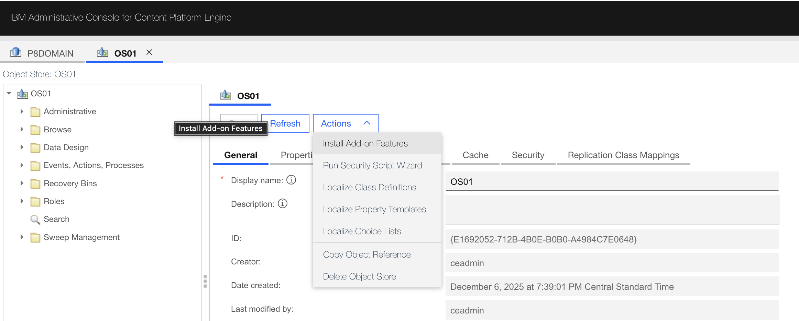
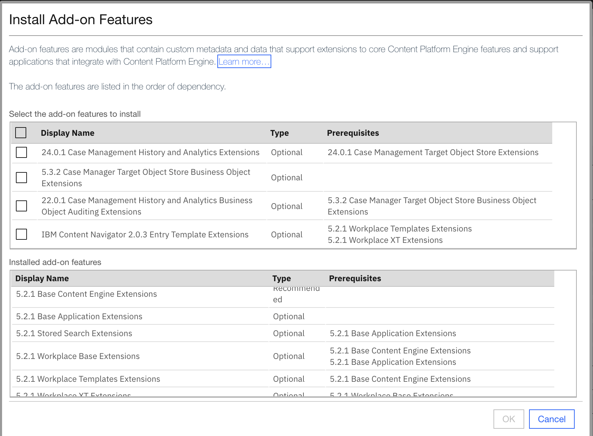
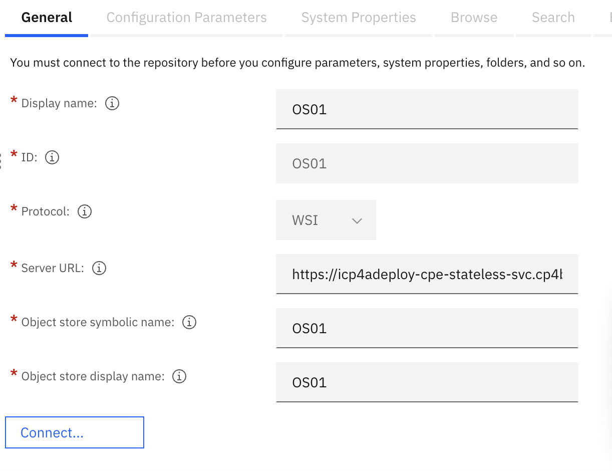
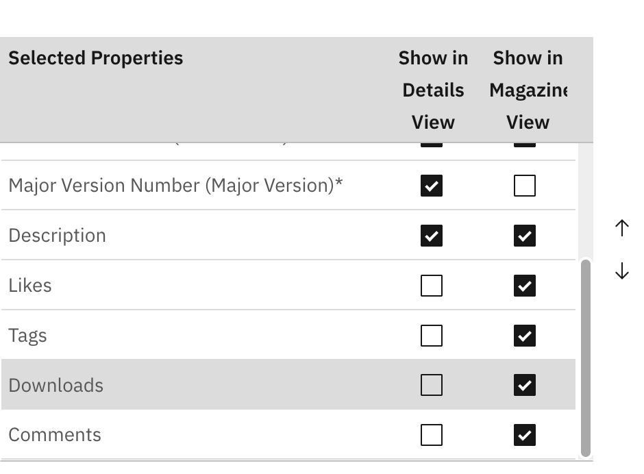
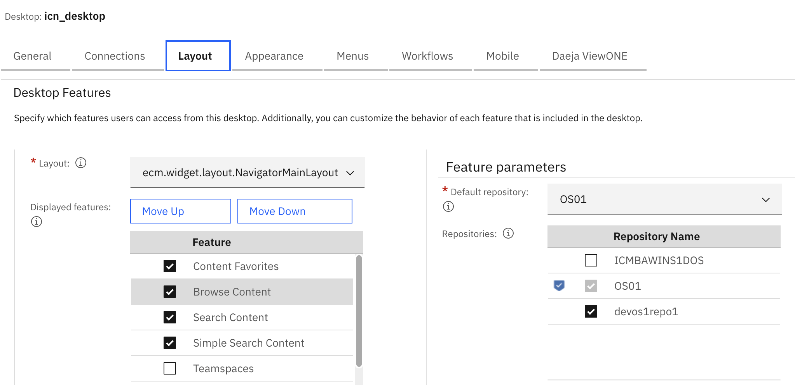

# Arrow CP4BA install

## Installing FileNet Addon features

From the ACCE interface:
```
https://cpd-cp4ba.apps.itz-bfproc.infra01-lb.wdc04.techzone.ibm.com/cpe/acce/
```

Select **P8DOMAIN** > **Object Stores** > **OS01**.

Select **Action** > **Install Add-on Features**



In the Addon installation list, select the addons needed and click **OK**.



Click **OK** when done.

## Setting up connection to OS01 from icn-desktop

From the admin console:

```
icn/navigator/?desktop=admin
```

Go to **Connections** > **Repositories** and click on **New Repository** > **FileNet Content Manager**


Lets define the `OS01` object store as the new repository.

- Display Name: `OS01` (this can be anything - as long as you can know)
- ID: `OS01` (this is generated from the display name)
- Protocol: `WSI` (not editable)
- Server URL: `https://icp4adeploy-cpe-stateless-svc.cp4ba.svc:9443/wsi/FNCEWS40MTOM/` (I stole this from the devos1repo1 - for any of the local object store)
- Object store symbolic name: `OS01` (object store name)
- Object store display name: `OS01`



Click **Connect** - if connection is successful -

In the **Configuration Parameter** tab:
- Task manager connection ID - set to ceadmin and its password\
- Track downloads - set to Enable
- Sync services - set to Enable
- Document History - set to Enable
- Teamspace management - set to Enable
- Role-based redactions - set to Enable
- Entry template management - set to Enable

Click **Save**

In the **Browse** tab:
- Show in Details View: add **Description**
- Show in Magazine View: add Likes, Tags, Downloads, Comments



Click **Save and close**

> **_NOTE:_** Log out and log back in (this may not be necessary - but I did this)

Go to **Desktop** and open **icn_desktop**, 

- Select the **Connections** tab and make sure the new OS01 connection is there and move it to Selected Connections column. Click **Save**.

- Go to the **Layout** tab and select **Browse Content**, change the Default Repository to `OS01` so the blue icon shows beside OS01. Perform the same action to **Search Content**.



Click **Save and close**

> **_NOTE:_**  Log out and log back in (this may not be necessary - but I did this)

Now the Browse feature should be able to get to the OS01.


